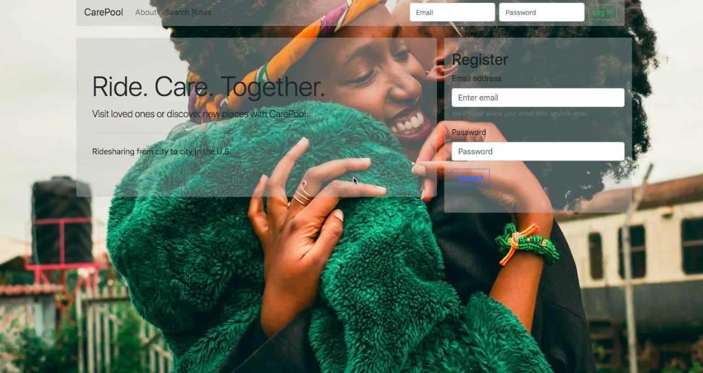

# Carepool

CarePool is a city to city rideshare application that gives users visual feedback on their environmental impact. Target users are people without a car who visit family across the state, travelers without a car, and people who want to reduce their carbon footprint by having fewer cards on the road. CarePool also makes long distance traveling more economic.

Using the Google Places API, users can add and search for rides. If a ride to a destination is not found, nearby rides are returned using the Google Distance Matrix API. With the Twilio API, users can quickly send updates. Also, users receive visual feedback with ChartJS on how much CO2 they have saved over time by carpooling and how much CO2 would have been emitted if each user drove. CarePool has 78% test coverage.

## Project Tech/Framework

Python, JavaScript, jQuery, AJAX, Bootstrap, ChartJS, Jinja, HTML/CSS, PostGresQL, SQLAlchemy

## APIs Used

Google Places APi, Google Distance Matrix API, Twilio API

## Demo
Watch the demo [here](https://vimeo.com/290716122)

